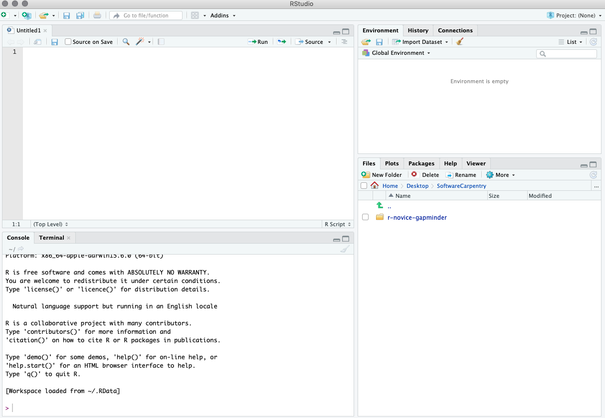

# Quicklinks
* [Getting started with R and Rstudio](#start)
* [Introduction to R](#intro)
* [Workshop material](#material)
* [Steps for a successful workshop](#steps)
    * [Before the workshop](#before)
    * [During the workshop](#during)
    * [After the workshop](#after)
* [About the SCS](#about)

```{r, echo=FALSE}
htmltools::img(src = 'logo.png', 
               alt = 'logo', 
<<<<<<< HEAD
               style = 'position:absolute; top:150px; 
               left:550px; padding:10px;')
=======
               style = 'position:absolute; top:50px; 
               left:50px; padding:0px;')
>>>>>>> 33ae523841cda561fb7f4d641460fe4a99e138f4
```


---

## Introduction
It is impossible to be an expert in all aspects of science, mathematics, statistics, business, communication, psychology and all the other myriad skills necessary to solve complex problems in the real world. UConn's Statistical Consulting Services aims to bridge the gap between statisticians and domain experts from across disciplines at UConn and Connecticut. We provide statistical support in the form of [statistical consultations](https://statsconsulting.uconn.edu/), seminars and workshops. 

### Aims of this workshop series
The aims of this workshop series are to i) introduce participants to statistical and data visualization tools available in R, ii) promote the use or R by participants in their own work and research, and ii) promote reproducible research through making all code and workshop content freely available to all participants. 

### What's in this page
This page is going to guide you through **steps to take** to prepare for the upcoming workshops. The primary goals are to: \newline
1. Have each participant ready to use R and Rstudio. \newline
2. Provide pratical tips on how to prepare for the workshops. \newline
3. Outline the content of each workshop. \newline
4. Link to important resources. \newline


### Workshop Survey
Before participating in one of our workshops please [register here](https://statsconsulting.uconn.edu/workshop-schedule/), and be complete our [pre-workshop survey](). This **suvery** is a valuable tool, allowing us to ensure that you get the most out of our workshops.  

---

## Getting started with R and Rstudio{#start}

### Installing R and Rstudio
#### Windows
Install **R** by downloading and running [this .exe](https://cran.r-project.org/bin/windows/base/release.htm) file from [CRAN](https://cran.r-project.org/index.html). Also, please install the **RStudio** [IDE](https://www.rstudio.com/products/rstudio/download/#download). Note that if you have separate user and admin accounts, you should run the installers as administrator (right-click on .exe file and select "Run as administrator" instead of double-clicking). Otherwise problems may occur later, for example when installing R packages.

#### MacOS
Install **R** by downloading and running [this .pkg file](https://cran.r-project.org/bin/macosx/R-latest.pkg) from [CRAN](https://cran.r-project.org/index.html). Also, please install the **RStudio** [IDE](https://www.rstudio.com/products/rstudio/download/#download).

#### Linux
You can download the binary files for your distribution from CRAN. Or you can use your package manager (e.g. for Debian/Ubuntu run 'sudo apt-get install r-base' and for Fedora run 'sudo dnf install R'). Also, please install the **RStudio** [IDE](https://www.rstudio.com/products/rstudio/download/#download).

* **Note for the power analysis workshops:** Install **G*Power** by following the links on [this page](https://www.psychologie.hhu.de/arbeitsgruppen/allgemeine-psychologie-und-arbeitspsychologie/gpower.html), depending on your native OS.

### A brief intro to R and Rstudio
*This content has been adapted from a [Carpentries](https://carpentries.org/) lesson. For more detail visit [this website](https://swcarpentry.github.io/r-novice-gapminder/01-rstudio-intro/).


#### What is Rstudio?
Rstudio is a free, open source R Integrated Development Environment (IDE). It provides a built in editor, works on all platforms (including on servers) and provides many advantages such as integration with version control (e.g., git) and project management. Essentially, it is the interface we will use to communicate with R. 

#### Basic layout of RStudio
When you first open RStudio, you will be greeted by three panels:
* The interactive R console/Terminal (entire left)
* Environment/History/Connections (tabbed in upper right)
* Files/Plots/Packages/Help/Viewer (tabbed in lower right):


One option for working in **Rstudio** would be to write all of our R commands directly into the *console*. One of the benefits of **Rstudio**, though is that we can store all of our commands in a document, or _script_, which we can then share with collaborators or publish along with our research. In fact, we can use documents generated in **R** and **Rstudio** to build webpages (like this one!). 

To open a new _R script_ go to File > New File > R Script. Now, the **Rstudio** window should have four panes, like this:



All of you code can now be written in this script and saved on your computer for later. Next we will run through some basics of R syntax. 

### Introduction to R{#intro}

---
## Workshop material{#material}

---
## Steps for a successful workshop{#steps}

### Before the workshop{#before}

### During the workshop(#during)

### After the workshop(#after)

--- 

## About the SCS{#about}